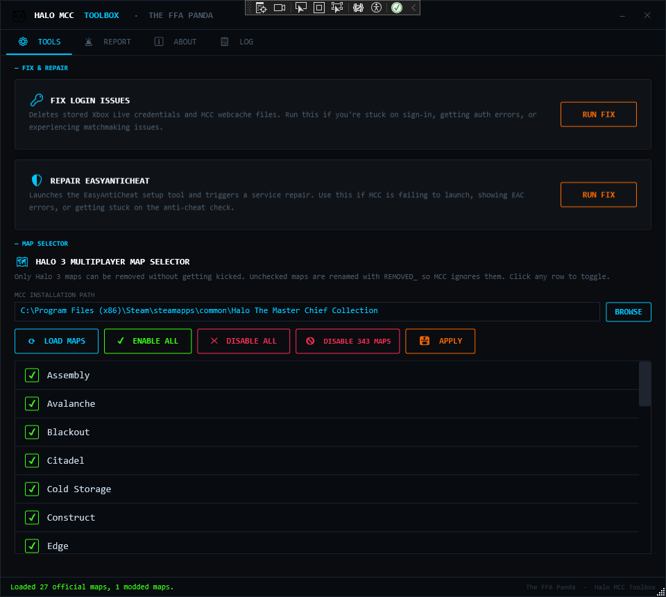
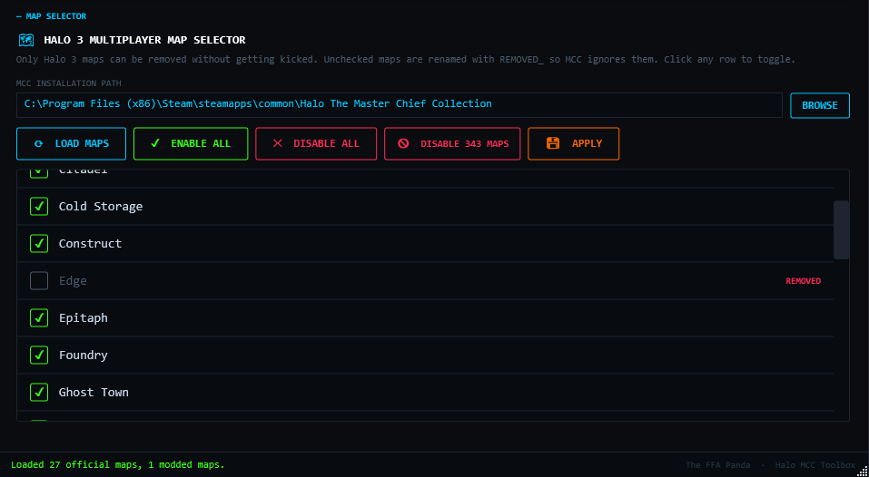
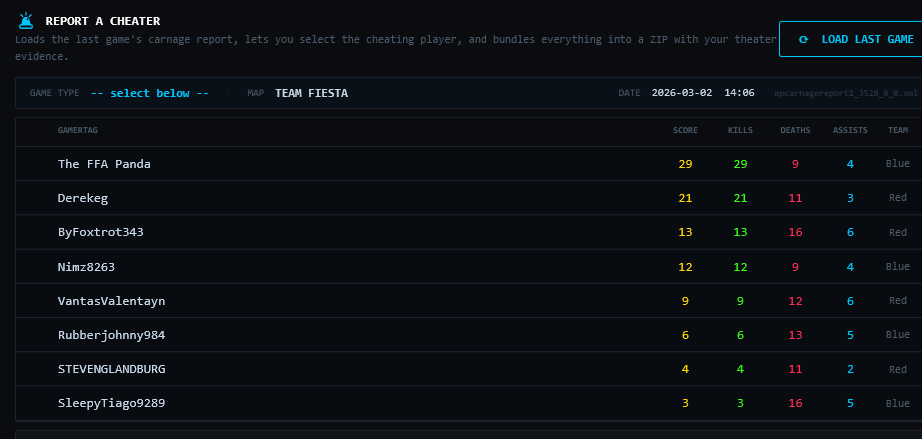
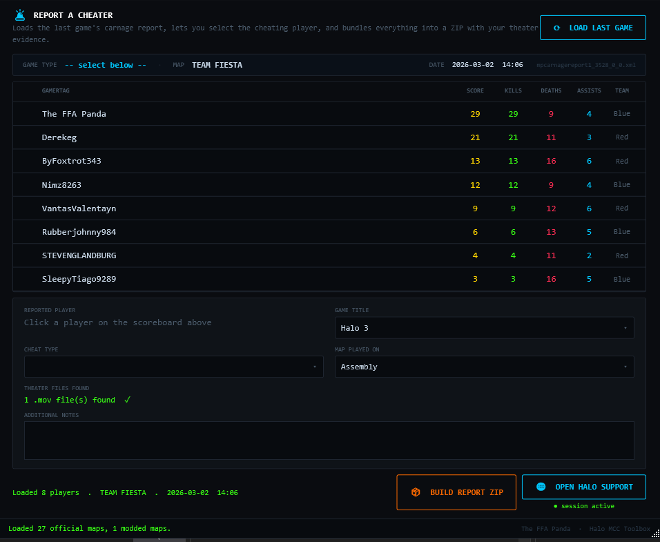
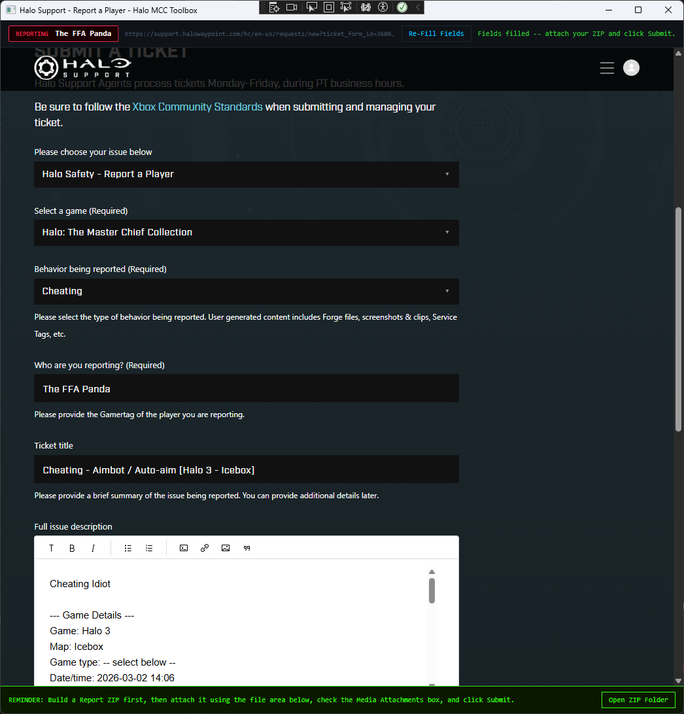
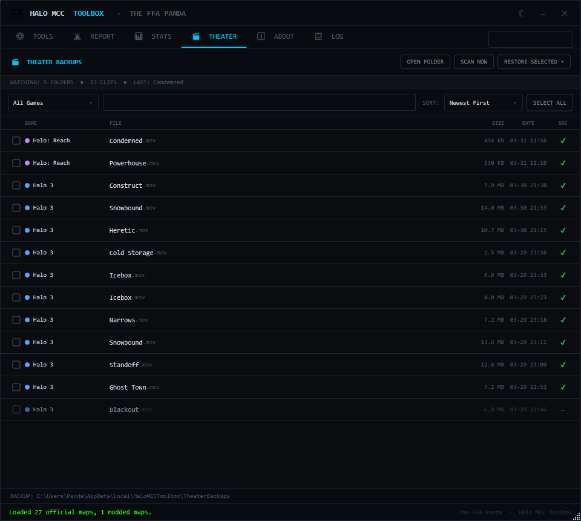
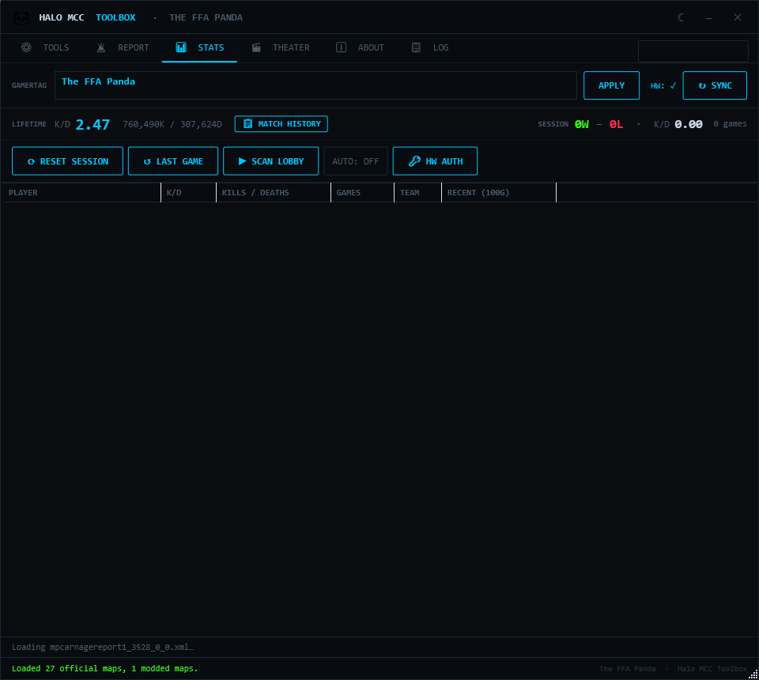
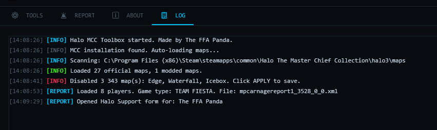

# 🐼 Halo MCC Toolbox

> A Windows utility for Halo: The Master Chief Collection players — fix common issues, manage your map rotation, and build structured cheater reports with evidence.

**Made by The FFA Panda**

---



---

## Features at a Glance

| Feature | What it does |
|---|---|
| **Fix Login Issues** | Clears stored Xbox Live credentials and MCC webcache to resolve sign-in / matchmaking errors |
| **Repair EasyAntiCheat** | Launches the EAC repair tool with one click |
| **Map Selector** | Enable or disable any Halo 3 multiplayer map from matchmaking without touching game files |
| **Live Stats Scanner** | Tracks your session, scans lobby players, and shows lifetime/recent K/D data from external stat sources |
| **Carnage Report Loader** | Parses your last game's XML carnage report and displays a full scoreboard |
| **Cheater Evidence ZIP** | Packages the carnage report XML + theater `.mov` files into a ZIP for submission |
| **Theater Backups** | Automatically backs up MCC theater clips, lets you rename them, and restore them later by selection or game |
| **Halo Support Integration** | Opens the Halo Waypoint report form pre-filled with all player/game details |
| **Persistent Login** | Remembers your Halo Support login so you don't re-authenticate every time |
| **Session Status Indicator** | Shows whether your Halo Support session is active before you open the form |

---

## Requirements

- **Windows 10 / 11** (x64)
- **[.NET 8 Desktop Runtime](https://dotnet.microsoft.com/en-us/download/dotnet/8.0)** — required to run the app
- **[Microsoft Edge WebView2 Runtime](https://developer.microsoft.com/en-us/microsoft-edge/webview2/)** — required for the Halo Support browser (usually already installed on Windows 11)
- **Halo: The Master Chief Collection** installed via Steam

> **Note:** The app does not require administrator rights for most features. The EasyAntiCheat repair will request UAC elevation when launched.

---

## Installation

1. Download the latest release from the [Releases](../../releases) page
2. Extract the ZIP anywhere on your PC
3. Run **`HaloMCCToolbox.exe`**

No installer needed.

---

## Usage Guide

### ⚙ Tools Tab


#### Fix Login Issues

Clears your stored Xbox Live credentials and the MCC webcache directory. Use this when:

- MCC is stuck on the sign-in screen
- You're seeing authentication errors in matchmaking
- You want to switch Xbox accounts

The tool runs `cmdkey` to remove stored XBL credentials and then deletes files from:
```
%userprofile%\AppData\LocalLow\MCC\Saved\webcache\
```

**MCC must be closed before running this.** After cleanup, relaunch MCC and sign in again.

---

#### Repair EasyAntiCheat

Launches the `easyanticheat_setup.exe` bundled with your MCC installation. Use this when:

- MCC fails to launch with an EAC error
- You see "EasyAntiCheat service is not installed" messages
- MCC gets stuck on the anti-cheat initialization screen

When the EAC setup opens, click **Repair Service**, wait for it to complete, then relaunch MCC.

The tool automatically finds `easyanticheat_setup.exe` relative to your configured MCC path, falling back to the default Steam location:
```
C:\Program Files (x86)\Steam\steamapps\common\Halo The Master Chief Collection\installers\
```

---

#### Halo 3 Map Selector



Lets you control which Halo 3 multiplayer maps appear in your matchmaking rotation. This works by renaming disabled map files with a `REMOVED_` prefix — MCC skips any `.map` file with that prefix when building playlists.

> **Why only Halo 3?** Removing maps from other games causes disconnects. Halo 3's playlist system gracefully ignores `REMOVED_` maps without kicking you.

**How to use:**

1. Set your **MCC Installation Path** (defaults to the Steam path automatically)
2. Click **⟳ LOAD MAPS** — all Halo 3 multiplayer maps appear in the list
3. Click any row to toggle it **enabled / disabled**
4. Use the quick-action buttons:
   - **✓ ENABLE ALL** — re-enables every map
   - **✕ DISABLE ALL** — disables every map
   - **🚫 DISABLE 343 MAPS** — disables the three MCC-exclusive maps added by 343/Saber3D (Edge, Waterfall, Icebox)
5. Click **💾 APPLY** to rename the files on disk

**Official maps supported (25 total):**

| DLC Pack | Maps |
|---|---|
| Base Game | Construct, Epitaph, Guardian, High Ground, Isolation, Last Resort, Narrows, Sandtrap, Snowbound, The Pit, Valhalla |
| Heroic Map Pack | Foundry, Rat's Nest, Standoff |
| Legendary Map Pack | Avalanche, Blackout, Ghost Town |
| Cold Storage | Cold Storage |
| Mythic Map Pack | Assembly, Orbital, Sandbox |
| Mythic II Map Pack | Citadel, Longshore, Heretic |
| MCC Exclusive | Edge, Waterfall, Icebox |

Modded/custom `.map` files are detected automatically and listed under a **MODDED MAPS** divider.

---

### 🚨 Report Tab

The Report tab is a full cheater-reporting pipeline — from loading the carnage report to submitting the ticket on Halo Waypoint.

#### Step 1 — Load the Game



Click **⟳ LOAD LAST GAME**. The tool automatically finds the most recent `mpcarnagereport*.xml` in:
```
%userprofile%\AppData\LocalLow\MCC\Temporary\
```

If no file is found automatically, a file picker opens so you can select one manually.

Once loaded, the full scoreboard appears showing each player's **Gamertag, Score, Kills, Deaths, Assists, Betrayals,** and **Team**. Click any row to select the player you want to report.

---

#### Step 2 — Fill In the Report Form



After selecting a player, fill in the details:

| Field | Description |
|---|---|
| **Game Title** | Which MCC game the match was played in (Halo CE, Halo 2, H2A, Halo 3, Halo Reach, Halo 4) |
| **Cheat Type** | What the player was doing (see options below) |
| **Map Played On** | Map list automatically filters to the selected game title |
| **Theater Files** | Automatically counts `.mov` recording files for the selected map (Halo 3, Reach, H4 only) |
| **Additional Notes** | Any extra context you want included in the report |

**Cheat Type options:**
- Aimbot / Auto-aim
- Wall hacks / ESP
- Speed / movement hacks
- God mode / invincibility
- Map exploits / out of bounds
- Score / stat manipulation
- Host manipulation / lag switching
- Other (see description)

> **Theater support by game:** Halo CE and Halo 2 do not have Film/Theater mode in MCC, so the theater file section is hidden when those games are selected. Halo 3, Halo Reach, and Halo 4 all support theater recordings.

---

#### Step 3 — Build the Evidence ZIP

Click **📦 BUILD REPORT ZIP**. A save dialog opens and the tool packages:

```
CheatReport_[Gamertag]_[timestamp].zip
├── report.txt                         ← Human-readable summary
├── carnage_report/
│   └── mpcarnagereportXXX.xml         ← Raw game data from MCC
└── theater_files/
    └── asq_[map]_[hash].mov           ← Theater recordings (if found)
```

`report.txt` includes the full scoreboard, Xbox User IDs for every player (persistent across renames), cheat type, game details, and your notes.

After the ZIP is built, Explorer opens with it selected so you can drag it directly into the Halo Support form.

---

#### Step 4 — Submit to Halo Support



Click **🌐 OPEN HALO SUPPORT**. An embedded browser opens the Halo Waypoint support form and automatically fills in:

- **Game title:** Halo: The Master Chief Collection
- **Behavior type:** Cheating
- **Reported player gamertag**
- **Ticket title:** `Cheating - [Cheat Type] [Game - Map]`
- **Full description:** Game details, reported player info, Xbox User ID, cheat type, and scoreboard

Attach your evidence ZIP using the form's file upload area, check the **Media Attachments** box, and click **Submit**.

**Re-Fill Fields** button at the top re-runs the auto-fill if the page reloads or fields get cleared.

---

#### Session Status Indicator

The **🌐 OPEN HALO SUPPORT** button shows a small status pill below it:

| Indicator | Meaning |
|---|---|
| `● session active` (green) | A Halo Waypoint / Microsoft Account login is saved locally — you'll go straight to the form |
| `● login required` (red) | No saved session found — you'll need to sign in when the window opens |
| `● checking session…` (gray) | Status check in progress on startup |
| `● status unknown` (orange) | Could not read session data (harmless — the form will still open) |

The indicator updates automatically when the support window closes, so it reflects a fresh login immediately.

**Your login session is saved** in `%LocalAppData%\HaloMCCToolbox\WebView2\` and persists across app restarts. You typically only need to log in once per several weeks (until Halo Waypoint expires the session server-side).

---

### Stats Tab



The Stats tab is a live lobby scanner and session tracker for MCC. It lets you save a primary gamertag, pull lifetime K/D, watch your current session record, and compare the players from your most recent carnage report.

#### What it shows

- **Lifetime K/D** and total kills / deaths for the gamertag in the top bar
- **Session record** with wins, losses, games played, and running K/D for the matches you've logged this session
- **Lobby table** showing each player's K/D, kills / deaths, games played, team, and recent 100-game trend when Halo Waypoint auth is available
- **Team summary** for team games, including weighted average K/D and a quick favored indicator

#### How to use it

1. Enter your gamertag and click **APPLY**
2. Click **SYNC** to refresh your own stats manually
3. Click **LAST GAME** to load the latest `mpcarnagereport*.xml` from `%userprofile%\AppData\LocalLow\MCC\Temporary\`
4. Click **SCAN LOBBY** to fetch stats for the players found in that carnage report
5. Turn **AUTO: ON** if you want the tool to auto-scan each newly detected match after it is logged

#### Buttons and actions

- **RESET SESSION** clears the current session wins, losses, and running K/D
- **MATCH HISTORY** opens detailed recent match history for your saved gamertag
- **HW AUTH** captures a Halo Waypoint token so the app can load recent 100-game data and open per-player match history
- Double-clicking a player row opens that player's match history when HW auth is active

If Halo Waypoint auth is unavailable, the tab still works for session logging and can fall back to basic lifetime stat lookups where possible.

---

### Theater Tab



The Theater tab watches MCC's theater folders, backs up every `.mov` clip it finds, and gives you a searchable library you can restore later. It is designed to protect clips before MCC rotates them out or a reinstall wipes the local files.

#### What it does

- Scans supported MCC theater folders for **Halo 2: Anniversary, Halo 3, Halo 3: ODST, Halo 4, and Halo: Reach**
- Automatically copies new clips into a backup library at `%LocalAppData%\HaloMCCToolbox\TheaterBackups\`
- Tracks whether the original source file still exists in MCC or only the backup copy remains
- Resolves Halo 3 clip filenames into friendly map names when possible
- Lets you assign custom names to clips by double-clicking a row

#### How to use it

1. Open the **Theater** tab and let the initial scan finish
2. Use the **game filter**, **search box**, and **sort** menu to narrow the list
3. Click rows to select clips, or use **SELECT ALL**
4. Use **RESTORE SELECTED** to copy backups back into the original MCC theater folders
5. Use **OPEN FOLDER** to jump straight to the backup library, or **SCAN NOW** to refresh immediately

#### Extra actions

- Right-click a clip to open the source folder, open the backup folder, copy the backup path, restore a single clip, or delete it
- The status column shows whether the original source clip is still present in MCC
- Restore options support selected clips, all clips, or all clips for a specific game

The tab monitors `%userprofile%\AppData\LocalLow\MCC\Temporary\UserContent\` while it is open, so newly created clips are picked up and backed up automatically.

---

### Log Tab



Every action the toolbox takes is recorded in the log with a timestamp and color-coded severity:

| Color | Tag | Meaning |
|---|---|---|
| Cyan | `[INFO]` | General status / startup messages |
| White | `[STEP]` | Individual steps within a multi-part operation |
| Orange | `[RUN]` | An operation has started |
| Green | `[DONE]` | An operation completed successfully |
| Green | `[ENABLE]` | A map was re-enabled |
| Red | `[REMOVE]` | A map was disabled |
| Orange | `[WARN]` | Non-fatal warning |
| Red | `[ERROR]` | Something failed |
| Cyan | `[REPORT]` | Report/ZIP related events |
| White | `[ZIP]` | A file was added to the ZIP |

The **CLEAR LOG** button wipes the current session log.

---

## How the Map Disable Trick Works

MCC reads the Halo 3 map list from the `halo3\maps\` folder. Any `.map` file whose name starts with `REMOVED_` is silently skipped during playlist building.

The toolbox renames files rather than deleting them:

```
guardian.map          ← enabled (MCC loads it)
REMOVED_guardian.map  ← disabled (MCC ignores it)
```

Clicking **APPLY** iterates every map in the list and renames it to match its current enabled/disabled state. No files are ever deleted. Re-enable a map and apply again to restore it instantly.

---

## How the Cheater Report System Works

```
Load carnage XML  →  Select player  →  Fill form  →  Build ZIP  →  Submit ticket
       ↑                                                                   ↑
%AppData%\LocalLow\MCC\Temporary\           Embedded WebView2 browser
mpcarnagereport*.xml                        (auto-filled via JS injection)
```

The carnage report XML is written by MCC after every multiplayer match. It contains each player's **Gamertag, Xbox User ID, and all match statistics**. The Xbox User ID is important for reports because it is persistent and cannot be changed by renaming — even if a cheater changes their Gamertag after the match, the ID stays the same.

Theater `.mov` files are located at:
```
%userprofile%\AppData\LocalLow\MCC\Temporary\UserContent\
├── Halo3\Movie\        ← asq_[mapname]_[hash].mov
├── HaloReach\Movie\
└── Halo4\Movie\
```

For Halo 3 specifically, the toolbox uses a prefix mapping to match the cryptic internal filenames (e.g. `asq_guardia_xxxx.mov`) to friendly map names like "Guardian".

---

## Building from Source

**Requirements:**
- Visual Studio 2022 (or later) with the **.NET desktop development** workload
- .NET 8 SDK

**Steps:**
```
git clone https://github.com/[your-username]/HaloMCCToolbox
cd HaloMCCToolbox\HaloToolbox
start HaloToolbox.sln
```

Build → Run (`F5`). No extra configuration needed.

**Dependencies (NuGet):**
- `Microsoft.Web.WebView2` v1.0.2903.40

---

## Project Structure

```
HaloToolbox/
├── HaloToolbox.sln
└── HaloToolbox/
    ├── App.xaml / App.xaml.cs              ← App-level styles and dark theme
    ├── MainWindow.xaml / .cs               ← Main UI (all 4 tabs + core logic)
    ├── HaloReportWindow.xaml / .cs         ← WebView2 popup for Halo Support form
    ├── WebViewEnvironmentManager.cs        ← Persistent WebView2 session singleton
    └── HaloToolbox.csproj
```

---

## Notes & Limitations

- **Map Selector is Halo 3 only.** Disabling maps for other MCC games will cause disconnects from lobbies. This is a limitation of how those games handle their map lists in MCC.
- **Carnage reports are Halo 3 only** (the XML format used by the parser). Other games in MCC may use different formats or may not write carnage reports to the same location.
- **Theater detection is best-effort.** The `.mov` filename-to-map mapping for Halo 3 was reverse-engineered from the internal map names. Reach and Halo 4 return all `.mov` files in the game's folder since those don't have the same prefix naming scheme.
- **The Halo Support form auto-fill** depends on Zendesk's field IDs staying consistent. If 343/Halo Support redesigns their form, the auto-fill may stop working — you can always fill the fields manually in the embedded browser.
- **Session persistence** stores data in `%LocalAppData%\HaloMCCToolbox\WebView2\`. Deleting this folder will clear your saved login.

---

## License

BSD3 License — see [LICENSE](LICENSE) for details.

Free to use, modify, and distribute. Credit appreciated but not required.

---

## Credits

**The FFA Panda** — design, development, and testing

Built with:
- [WPF / .NET 8](https://dotnet.microsoft.com/)
- [Microsoft Edge WebView2](https://developer.microsoft.com/en-us/microsoft-edge/webview2/)
- Consolas — the only acceptable monospace font

---

*If this tool helped you report a cheater, that's a win. 🐼*
