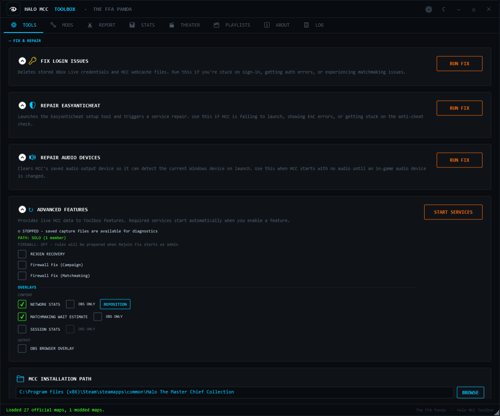

# 🐼 Halo MCC Toolbox

> A Windows companion for **Halo: The Master Chief Collection** — repair common problems, inspect matchmaking, track sessions, protect films, manage maps, use offline mods, and build better cheater reports.

**Made by The FFA Panda**



## What it does

### Tools, network, and maps

The Tools tab handles the everyday MCC fixes and the services that power live features:

- **Fix Login Issues** clears stored Xbox Live credentials and MCC webcache files.
- **Repair Easy Anti-Cheat** locates MCC's EAC setup and starts a service repair.
- **Repair Audio Devices** resets MCC's saved output device when the game launches without sound.
- **Rejoin Recovery** preserves matchmaking/session connection context for experimental crash-recovery and diagnostics.
- **MCC-only firewall controls** provide separate Campaign and Matchmaking modes, including an automatic matchmaking option.
- **Live overlays** show network stats, server region, matchmaking wait estimates, and session performance. Each component can be player-visible, OBS-only, or published through the local OBS browser source.
- **Halo 3 Map Selector** enables or disables individual maps by safely renaming them with a `REMOVED_` prefix. It includes Enable All, Disable All, Disable 343 Maps, and custom-map detection.

Advanced services only start when a feature needs them. The toolbox shows service, path, party, and firewall state in the UI instead of silently changing the system.

### Offline mods

| Halo 3 runtime tools | Halo: Reach lighting |
|:---:|:---:|
|  |  |

The Mods tab contains two EAC-disabled toolsets:

- **Halo 3:** safe auto-attach checks, Acrophobia/Bandana toggles, freecam, camera/player freeze, third-person view, coordinate control, gameplay patches, and one-click restoration.
- **Dolly Cam:** capture or continuously record camera points, adjust timing and speed, edit keyframes, preview the track, and play a smoothed camera path.
- **Halo: Reach:** arm the lighting hook before entering Reach, then disable the identified patched bloom/downsample shader for a clearer pre-patch presentation.

> Runtime mods and the Reach lighting hook are for offline play with **Easy Anti-Cheat disabled**. Controls remain locked until the toolbox verifies a safe runtime.

### Stats and matchmaking


Stats combines live matchmaking observations with MCC carnage reports and optional Halo Waypoint data:

- Save a primary gamertag and view lifetime K/D, kills, deaths, recent form, and match history.
- Inspect the **current lobby** or the **last completed game**, including squads, teams, K/D, games played, MMR percentile, and each player's best observed server.
- Compare team strength and quickly see which side is favored.
- Browse live matchmaking population, average wait, queue activity, and population history.
- Track a full session: W/L, win rate, K/D, kills, deaths, best spree, multikill medals, per-game timelines, and repeat player encounters.
- Scan up to 15 gamertags or XUIDs with the Ban Checker.

Halo Waypoint connection is optional. It enables richer recent stats and history; the toolbox never asks for or stores your Microsoft password.

### Theater library and film recovery

| Film backup library | Downpatch recovery workspace |
|:---:|:---:|
|  |  |

The Theater tab watches MCC's film folders and keeps a local backup library for **Halo 2: Anniversary, Halo 3, Halo 3: ODST, Halo 4, and Halo: Reach**.

- Search and sort films, assign friendly names, and see whether the original MCC copy still exists.
- Restore selected films, every film, or all films for one game.
- Copy selected backups elsewhere with readable filenames or open either source folder directly.
- Use **Downpatch Recovery** to inspect a film's saved build date and prepare an isolated MCC version workspace when an older build is required.
- Copy the generated Steam depot/launch commands without replacing the current Steam installation.

### Cheater reports


The Report tab turns MCC's latest carnage report into a structured evidence package:

1. Load the newest `mpcarnagereport*.xml` and review the scoreboard.
2. Select the reported player, game, map, cheat type, and matching theater evidence.
3. Build a ZIP containing a readable summary, the raw carnage XML, and available film files.
4. Open Halo Support in the embedded browser with the ticket details pre-filled, then attach the ZIP and submit.

Xbox User IDs are included in the report summary so the evidence remains useful if a player later changes their gamertag. The embedded browser keeps its Halo Support session locally between launches.

### Playlist explorer


The Playlists tab reads MCC's live `findgamehopperdb-v4.xml` and makes the hopper database understandable:

- Browse Social or Ranked playlists by game size and playlist name.
- Filter by included titles and categories.
- Inspect map, mode, variant, raw weight, and normalized share for every entry.
- Switch to **Rotation Schedule** to browse featured Social, Ranked 4v4, and Ranked 2v2 history and estimates.

## Install

1. Download the latest build from [Releases](../../releases).
2. Run **`HaloMCCToolbox.exe`** — no installer is required.
3. Complete first-run setup to locate MCC, optionally save your gamertag/connect Waypoint, and choose which sections appear.

The release is a self-contained **Windows x64** executable. You need Windows 10/11 and the Steam version of Halo: The Master Chief Collection. WebView2 is used for Halo Waypoint and Halo Support sign-in and is normally already installed on Windows 11.

Most features do not require administrator access. Firewall, recovery, and runtime-memory tools request elevation only when it is actually needed.

## Important notes

- Map removal is **Halo 3 only**; removing maps from other MCC titles can disconnect the player.
- Map files are renamed, never deleted, and can be restored immediately.
- Rejoin Recovery and matchmaking firewall automation are advanced/experimental features.
- Theater downpatching builds isolated folders and leaves the active Steam installation alone.
- Settings, caches, reports, browser sessions, and film backups remain local to the PC.

## Build from source

Open `HaloToolbox.sln` in Visual Studio 2022 with the **.NET desktop development** workload, or run:

```powershell
dotnet build HaloToolbox.sln -c Debug
```

A Release build also creates the self-contained executable in `HaloToolbox/bin/Standalone/`:

```powershell
dotnet build HaloToolbox.sln -c Release
```

## Credits

**The FFA Panda** — design and development  
**JumpyJsn** — icon  
**unit220** — testing

Discord / Twitch / X: `theffapanda` · YouTube: `The FFA Panda`
Also:
Shoutout to the below projects which inspired various functionalities, I've learned more from your projects than I can document!

H3 Dolly Cam:
https://www.nexusmods.com/halothemasterchiefcollection/mods/1888?tab=files&file_id=6683

Carnage Reporter:
https://github.com/CYRiXplaysHalo/CarnageReporter

Halo 3 Camera Tool:
https://github.com/Krevil/Halo3CameraTool


---

BSD 3-Clause License — see [LICENSE.txt](LICENSE.txt).
