# 🐼 Halo MCC Toolbox

> A Windows companion for **Halo: The Master Chief Collection** — repair common problems, inspect matchmaking, track sessions, protect films, manage maps, use offline mods, and build better cheater reports.

**Made by The FFA Panda**

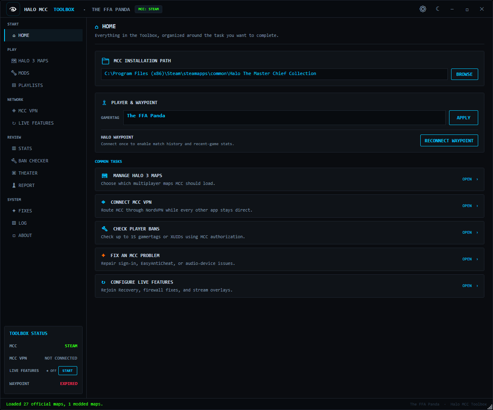

Halo MCC Toolbox is organized around a persistent vertical menu. Open a focused workspace for the task at hand while MCC edition, VPN, Live Features, and Waypoint status remain visible in the lower-left status card.

## Sidebar at a glance

| Group | Destinations | Purpose |
|---|---|---|
| **Start** | Home | Configure MCC and Waypoint, review status, and jump to common tasks. |
| **Play** | Halo 3 Maps, Mods, Playlists | Control installed content, use offline tools, and inspect playlist composition. |
| **Network** | MCC VPN, Live Features | Route only MCC through a VPN and manage live capture, recovery, firewall, and overlay services. |
| **Review** | Stats, Ban Checker, Theater, Report | Review players and sessions, preserve films, and assemble report evidence. |
| **System** | Fixes, Log, About | Repair MCC, inspect diagnostics, export logs, and view project information. |

Use the gear in the title bar to show or hide optional sidebar sections. The moon/sun control switches themes, and first-run setup can preselect the sections you care about without uninstalling anything.

## Features

### Home

Home keeps setup and everyday actions together:

- Detect or browse to a Steam or Microsoft Store/Xbox app installation.
- Save the gamertag used by Stats and optionally connect Halo Waypoint.
- Jump directly to maps, MCC VPN, Ban Checker, Fixes, or Live Features.
- See MCC edition, VPN, Live Features, and Waypoint state without leaving the current page.

### Halo 3 maps and playlist explorer

| Halo 3 Map Selector | Live Playlist Composer |
|:---:|:---:|
| 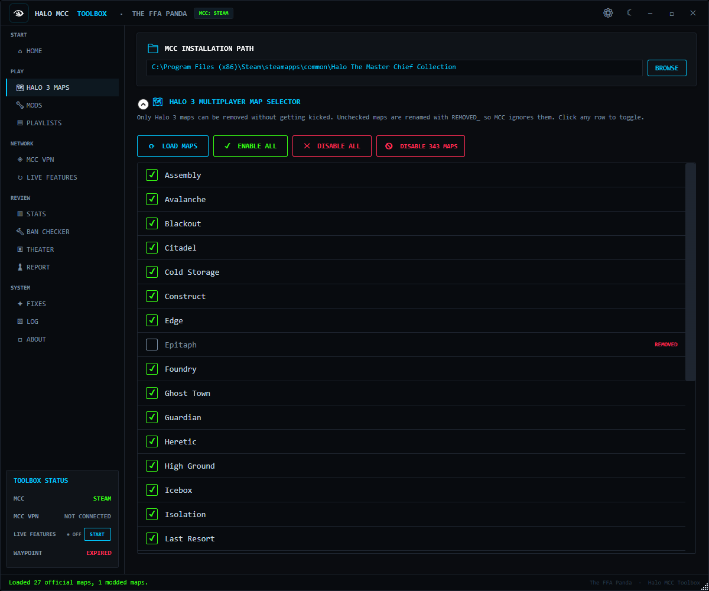 | 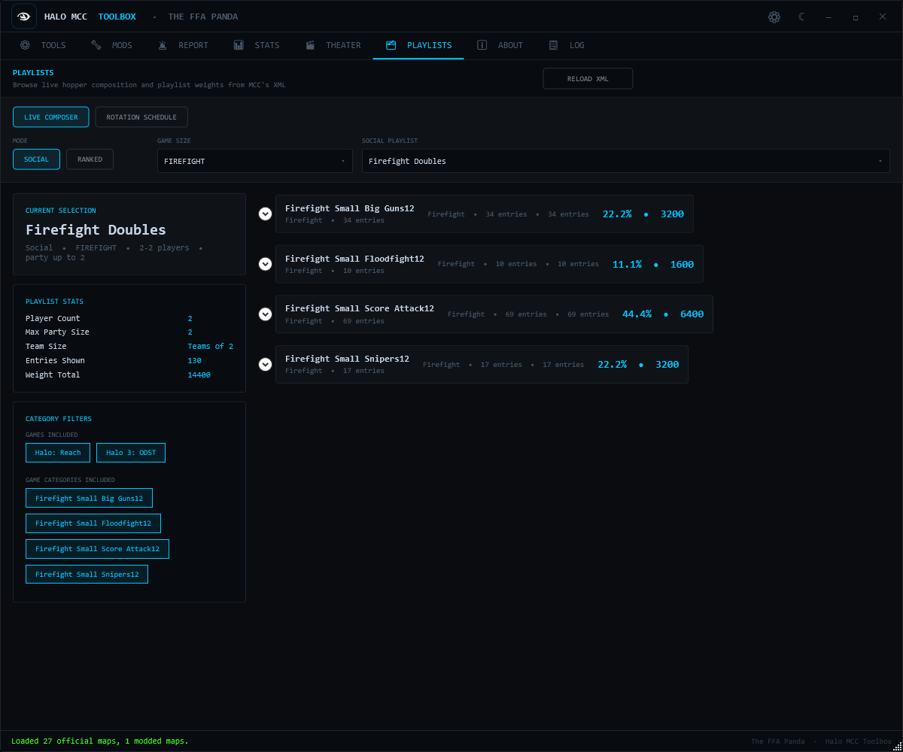 |

The **Halo 3 Map Selector** enables or disables individual multiplayer maps by safely adding or removing a `REMOVED_` filename prefix. It recognizes official and custom maps and includes Enable All, Disable All, and Disable 343 Maps actions.

The **Playlist Explorer** reads MCC's live `findgamehopperdb-v4.xml` and turns the hopper database into something readable:

- Browse Social and Ranked playlists by game size and playlist name.
- Filter by included games and categories.
- Inspect map, mode, variant, raw weight, and normalized share for every entry.
- Switch to **Rotation Schedule** for featured Social, Ranked 4v4, and Ranked 2v2 history and estimates.

### Offline mods

| Halo 3 runtime tools and Dolly Cam | Halo: Reach lighting |
|:---:|:---:|
| 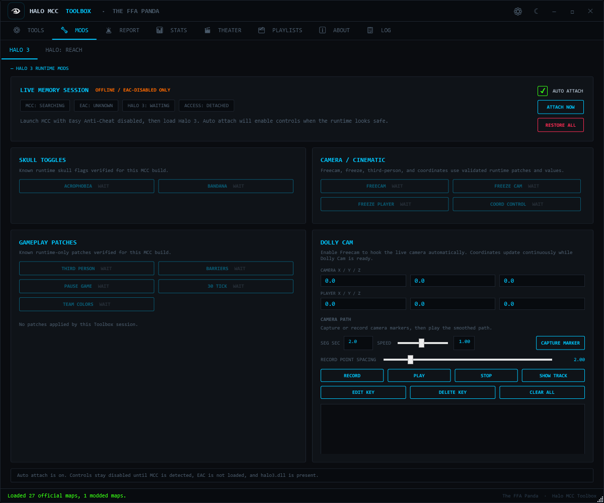 | 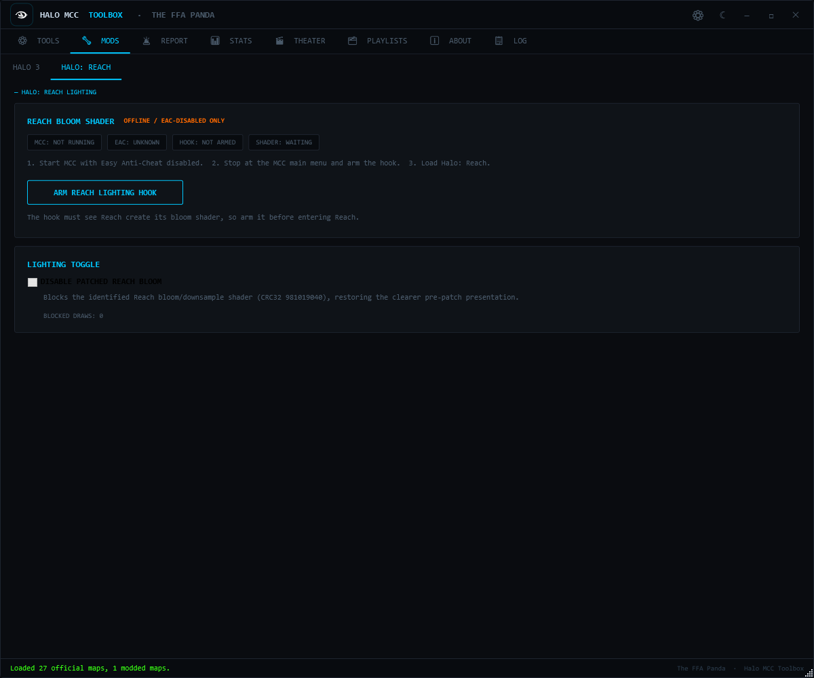 |

The Mods workspace contains two EAC-disabled toolsets:

- **Halo 3 runtime tools:** guarded auto-attach, Acrophobia and Bandana toggles, freecam, camera/player freeze, third-person view, coordinate control, barriers, pause, 30-tick, team-color patches, and one-click restoration.
- **Dolly Cam:** capture or continuously record camera markers, tune segment timing and speed, edit keyframes, preview the track, and play a smoothed camera path.
- **Halo: Reach lighting:** arm the hook before entering Reach, then block the identified bloom/downsample shader for a clearer pre-patch presentation.

> Runtime mods and the Reach lighting hook are for offline play with **Easy Anti-Cheat disabled**. Controls remain locked until the Toolbox verifies a safe runtime.

### MCC VPN

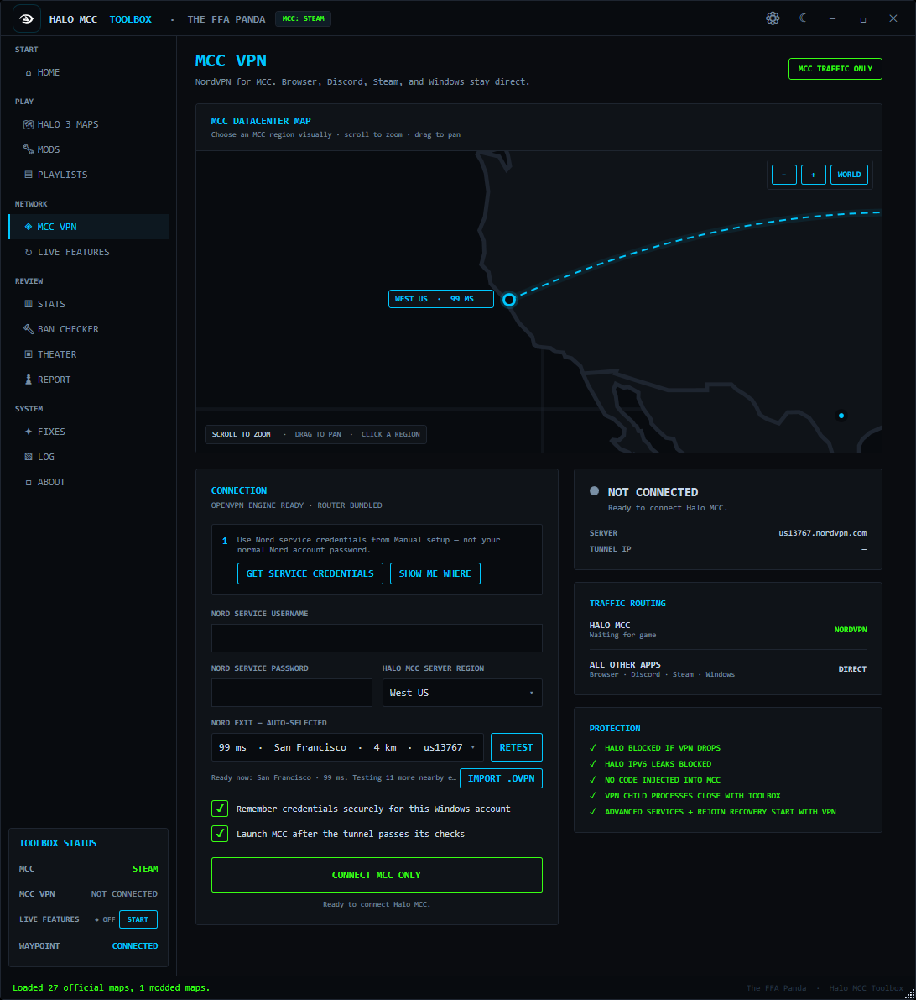

MCC VPN routes Halo through a NordVPN OpenVPN exit while browsers, Discord, Steam, Windows, and other apps remain on the normal connection.

- Pick a familiar MCC datacenter from the interactive world map.
- Test nearby Nord exits and automatically choose the fastest responsive server, with geographic distance and load as fallbacks when ping is blocked.
- Import a custom `.ovpn` profile when needed.
- Route both MCC TCP and UDP by process, block MCC IPv6 leaks, and fail closed if the tunnel drops.
- Optionally launch MCC after tunnel verification.
- Start Advanced Services and core Rejoin Recovery before MCC launches.

The NordVPN desktop app is not required. MCC VPN uses Nord service credentials from Manual setup, not the normal Nord account password.

### Live Features and Rejoin Recovery

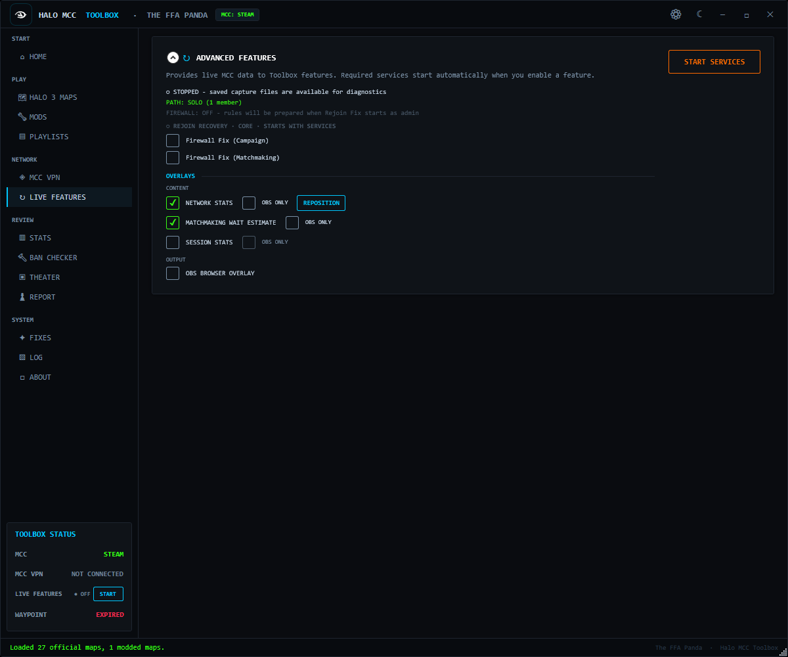

Live Features starts the supporting services only when a feature needs them and exposes the current path, party, capture, and firewall state in the UI.

- **Rejoin Recovery** is a core service that preserves matchmaking and session connection context for experimental crash recovery and diagnostics.
- **Steam-only firewall controls** offer separate Campaign and Matchmaking modes plus automatic matchmaking behavior. They are hidden for Microsoft Store installations.
- **Network Stats**, **Matchmaking Wait Estimate**, and **Session Stats** overlays can be player-visible, OBS-only, or published together through the local OBS browser source.
- Overlay windows can be repositioned and retain their layout.

### Stats

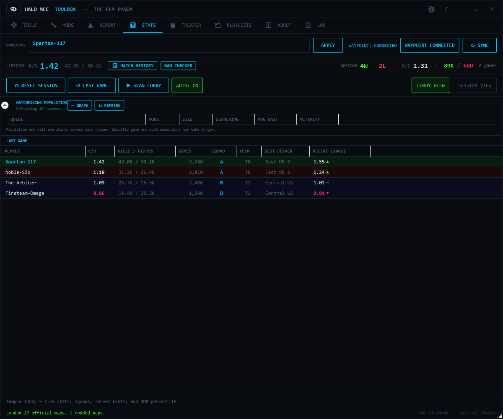

Stats combines live matchmaking observations, MCC carnage reports, and optional Halo Waypoint data:

- View lifetime K/D, kills, deaths, recent form, and match history for the saved gamertag.
- Inspect the current lobby or last completed game, including squads, teams, result, objective stats, games played, MMR percentile, and each player's best observed server.
- Compare team strength and see which side is favored.
- Browse live matchmaking population, average wait, queue activity, and population history.
- Track a full session with W/L, win rate, K/D, kills, deaths, best spree, multikill medals, per-game timelines, captured lobbies, and repeat encounters.

Halo Waypoint connection is optional. It adds richer recent stats and history; the Toolbox never asks for or stores your Microsoft password.

### Ban Checker

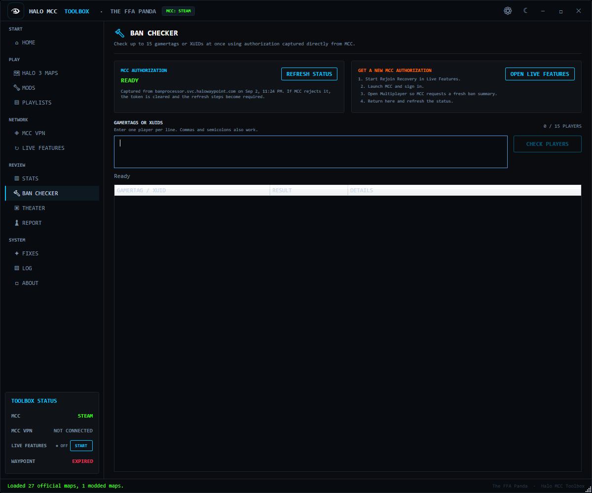

Ban Checker scans up to 15 gamertags or Xbox User IDs at once. It uses authorization observed directly from MCC traffic by Rejoin Recovery, reports each result in a dedicated grid, and explains how to refresh authorization when it expires.

### Theater library and Downpatch Recovery

| Film backup library | Downpatch Recovery |
|:---:|:---:|
| 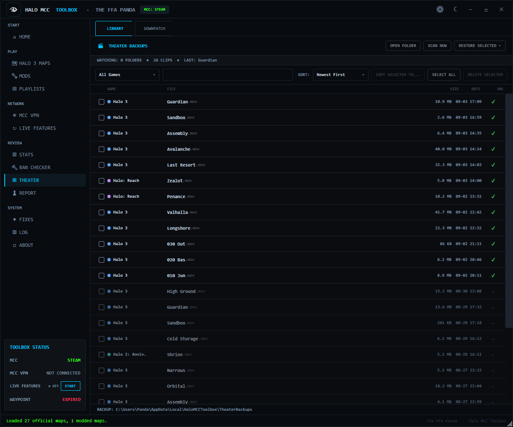 | 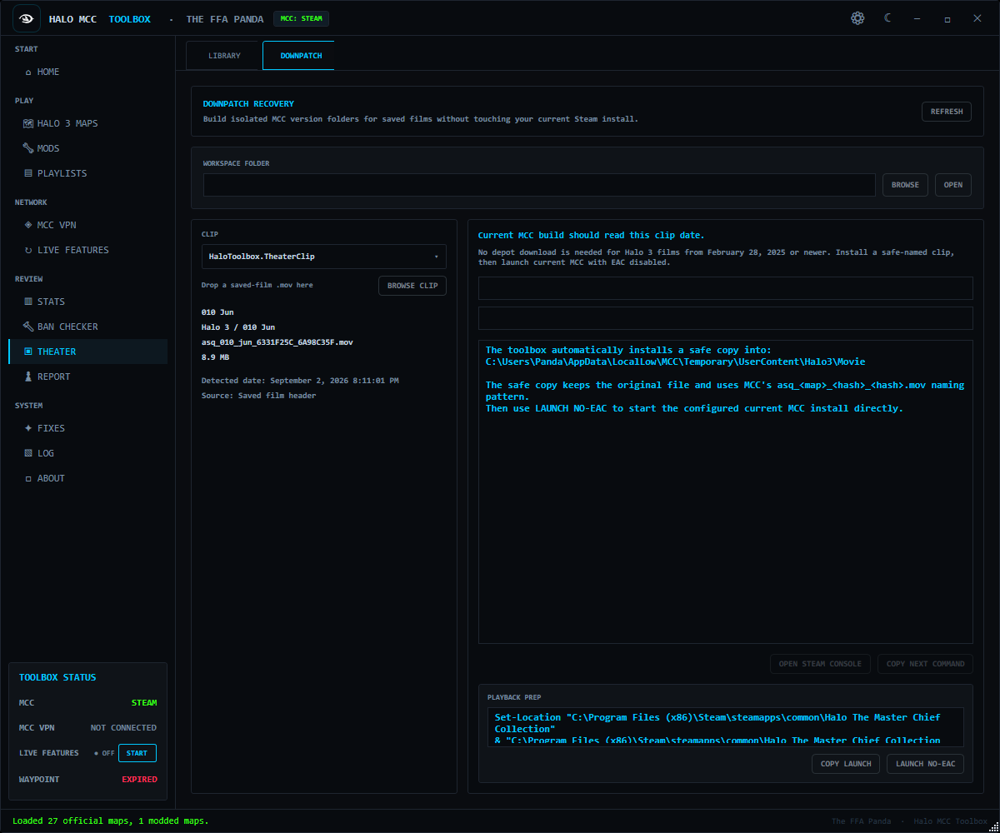 |

The Theater workspace watches MCC's film folders and keeps a local backup library for **Halo 2: Anniversary, Halo 3, Halo 3: ODST, Halo 4, and Halo: Reach**.

- Search and sort films, assign friendly names, and see whether the original MCC copy still exists.
- Restore selected films, every film, or all films for one game.
- Copy selected backups elsewhere with readable filenames or open either source folder directly.
- Safely install a current-build film under MCC's expected filename pattern without changing the backup.
- On Steam, use **Downpatch Recovery** for older Halo 3 films: identify the film's build window, prepare an isolated MCC workspace, copy the required Steam depot commands, watch their completion, stage the files, and launch with EAC disabled.

Downpatch Recovery leaves the active Steam installation untouched and is hidden for Microsoft Store installations.

### Cheater reports

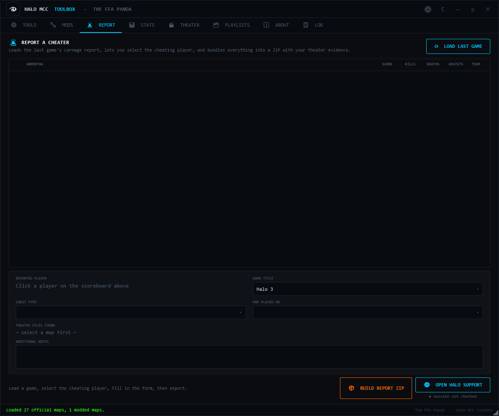

Report turns MCC's latest carnage report into a structured evidence package:

1. Load the newest `mpcarnagereport*.xml` and review the scoreboard.
2. Select the reported player, game, map, cheat type, and matching theater evidence.
3. Build a ZIP containing a readable summary, Xbox User IDs, the raw carnage XML, and available film files.
4. Open Halo Support in the embedded browser with the ticket details pre-filled, attach the ZIP, and submit.

Xbox User IDs keep the evidence useful if a player later changes their gamertag. The embedded browser keeps its Halo Support session local between launches.

### Fixes, diagnostics, and About

| Focused MCC repairs | Toolbox section guide |
|:---:|:---:|
| 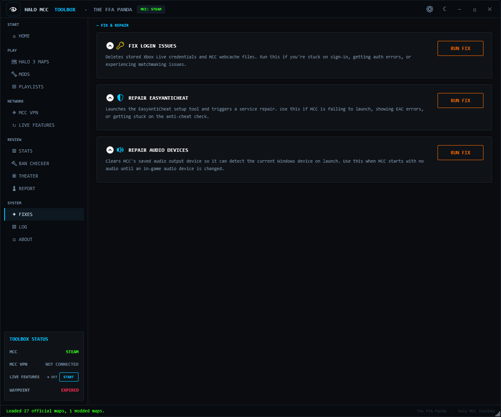 | 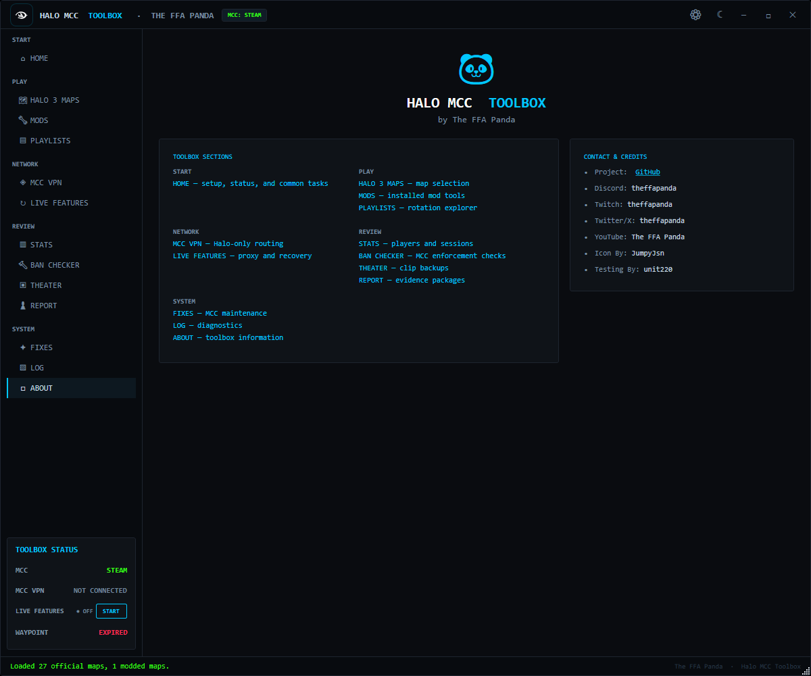 |

The **Fixes** page provides focused actions for common problems:

- Clear stored Xbox Live credentials and MCC webcache files when sign-in or matchmaking authorization is stuck.
- Locate MCC's Easy Anti-Cheat setup and start a service repair.
- Back up MCC settings and reset the saved audio output device when the game launches without sound.

The **Log** page centralizes Toolbox activity and provides firewall checks, copy/clear actions, a portable diagnostic export, and an explicit local-trace cleanup workflow. **About** provides an in-app guide to every sidebar destination alongside project links and credits.

## Install

1. Download the latest build from [Releases](../../releases).
2. Run **`HaloMCCToolbox.exe`** — no installer is required.
3. Complete first-run setup to locate MCC, optionally save your gamertag or connect Waypoint, and choose which sections appear in the sidebar.

The release is a self-contained **Windows x64** executable. You need Windows 10/11 and either the Steam or Microsoft Store/Xbox app version of Halo: The Master Chief Collection. WebView2 is used for Halo Waypoint and Halo Support sign-in and is normally already installed on Windows 11.

Most features do not require administrator access. VPN routing, firewall/recovery services, and runtime-memory tools request elevation only when needed.

On first use, MCC VPN downloads the pinned, signed OpenVPN Community prerequisite from `openvpn.net`, verifies its SHA-256 hash, and launches the passive Windows installer. The NordVPN desktop app must be uninstalled before using manual OpenVPN mode. See [docs/VPN.md](docs/VPN.md) for setup, behavior, and licensing details.

## Important notes

- Map removal is **Halo 3 only**; removing maps from other MCC titles can disconnect the player.
- Map files are renamed, never deleted, and can be restored immediately.
- Rejoin Recovery and matchmaking firewall automation are advanced/experimental features.
- Theater backup supports five MCC games; automated downpatch mapping is currently for Halo 3 on Steam.
- Downpatch Recovery builds isolated folders and leaves the active Steam installation alone.
- Settings, caches, reports, browser sessions, diagnostic exports, and film backups remain local to the PC.

## Build from source

Open `HaloToolbox.sln` in Visual Studio 2022 with the **.NET desktop development** workload, or run:

```powershell
dotnet build HaloToolbox.sln -c Debug
```

A Release build also creates the self-contained executable in `HaloToolbox/bin/Standalone/`:

```powershell
dotnet build HaloToolbox.sln -c Release
```

## Credits

**The FFA Panda** — design and development  
**JumpyJsn** — icon  
**unit220** — testing

Discord / Twitch / X: `theffapanda` · YouTube: `The FFA Panda`
Also:
Shoutout to the below projects which inspired various functionalities, I've learned more from your projects than I can document!

H3 Dolly Cam:
https://www.nexusmods.com/halothemasterchiefcollection/mods/1888?tab=files&file_id=6683

Carnage Reporter:
https://github.com/CYRiXplaysHalo/CarnageReporter

Halo 3 Camera Tool:
https://github.com/Krevil/Halo3CameraTool


---

BSD 3-Clause License — see [LICENSE.txt](LICENSE.txt).
